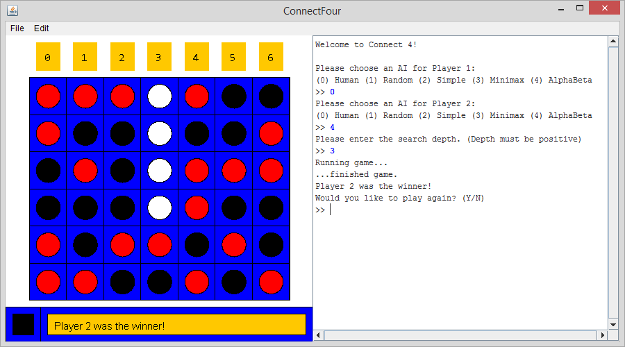

# Connect Four
A small program that implements the game of Connect Four. This was mostly implemented as an exercise in writing clean code (MVP pattern), as well as coding up some basic AIs. Connect Four was chosen due to its ease of depiction/representation, as well as its small branching factor. The ACM Java libraries were used for graphics, and the [dashboard](https://github.com/ShinyCode/dashboard) library was used for button functionality.

## Running Connect Four
A runnable JAR file is provided in the [dist](https://github.com/ShinyCode/connect-four/tree/master/dist) folder, but the ConnectFour class itself can also be run if the constants in ConnectFourConstants need to be tweaked.

## AIs Implemented
There are five AIs implemented in this program, which are described below:

1. **HumanAI** - This is technically not an AI, but this allows the user to click on the buttons above their respective columns to make a move.
2. **RandomAI** - This AI plays randomly, without regard to the prospect of winning/losing.
3. **SimpleAI** - If threatened with a three-in-a-row, this AI will block the opponent. In addition, if the SimpleAI discovers that it can win in one move, it will place the correct piece. Otherwise, it functions like the RandomAI.
4. **MinimaxAI** - This AI uses depth-limited minimax search to look ahead and determine which moves to take. The evaluation function used rewards three-in-a-rows the player achieves, but doubly penalizes three-in-a-rows the adversary achieves.
5. **AlphaBetaAI** - This AI improves on MinimaxAI by using alpha-beta pruning to prune the game tree and search deeper.
